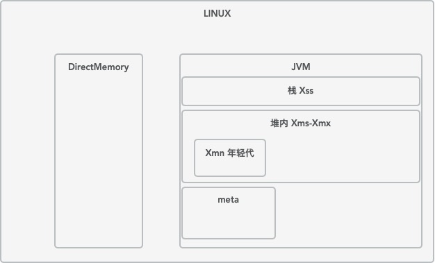

### Xmx,Xms,Xmn,Meta,DirectMemory,Xss

1. Xmx最大堆内存，不包括栈内存，不包括，非堆内存：对外内存，meta等
2. Xms初始化堆内存，小于Xmx
3. Xmn 新生代区域 属于堆内存的一部分，官方建议Xmx的1/2~1/4
4. meta 元数据区
5. DirectMemory 指定最大的对外内存，通常是nio使用
6. Xss栈所占用的空间

